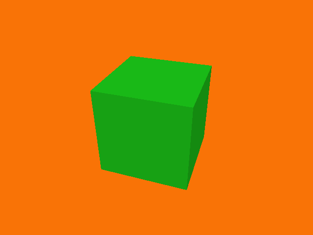

Worked Example
==============

The best way to illustrate Gloopy is with a worked example.

A Simple Cube
-------------

First we must initialise :class:`~gloopy.gloopy.Gloopy`::

    from gloopy import Gloopy

    gloopy = Gloopy()
    gloopy.init()

Next, we create a cube-shaped :class:`~gloopy.gameitem.GameItem`.::

    from gloopy.color import Color
    from gloopy.gameitem import GameItem
    from gloopy.shapes.cube import Cube

    item = GameItem( shape=Cube(1, Color.Green) )

A :class:`~gloopy.gameitem.GameItem` represents a single item to be
rendered. It is just a dumb collection of attributes, such as a `shape`, which
determines what it looks like. We can set these attributes using kwargs to the
constructor, as shown above, where we set this one to be a green cube of size
1.

:func:`~gloopy.shapes.cube.Cube` is a factory function that returns a new
instance of :class:`~gloopy.shapes.shape.Shape`. There are other shape factory
functions in the :mod:`~gloopy.shapes` module, or, after looking at those
examples and examining the :class:`~gloopy.shapes.shape.Shape` class, you can
write your own.

`Color.Green` is an instance of :class:`~gloopy.color.Color`, which is
applied to every face of the cube. Alternatively, you may pass a sequence of
colors, one for each face. This is a convention used by the 
:class:`~gloopy.shapes.shape.Shape` constructor,
and which is preserved by many of the factory functions which call it.

In order to see our cube rendered to the screen, we need to add it to the
world::

    gloopy.world.add(item)

``gloopy.world`` is an instance of :class:`~gloopy.world.World`, which is
just a dumb collection of :class:`~gloopy.gameitem.GameItem`
instances.

In order to give ourselves a dramatic view of the cube, let's position the
camera::

    from gloopy.geom.vector import Vector
    gloopy.camera.position = Vector(1, 2, 3)

By default, the camera looks at the origin, which is where the cube is located,
so we should get a good view of it.

Having completed all our setup, we call ``gloopy.run()``::

    gloopy.run()

This makes the pyglet window visible, schedules screen refreshes using
``pyglet.clock.schedule()`` and calls ``pyglet.app.run()``, which will
continue displaying our cube until the escape key is pressed.

This script can be found at examples/simple_cube.py

